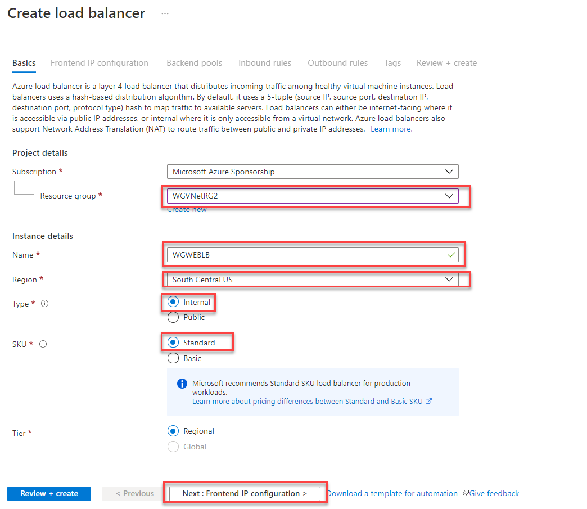
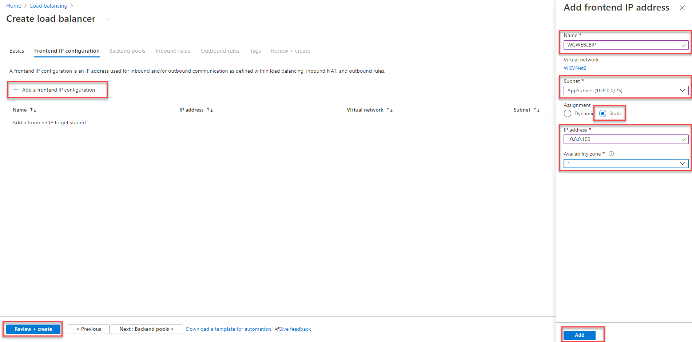
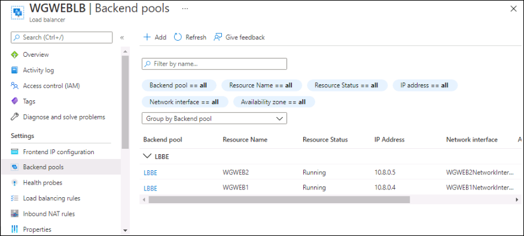
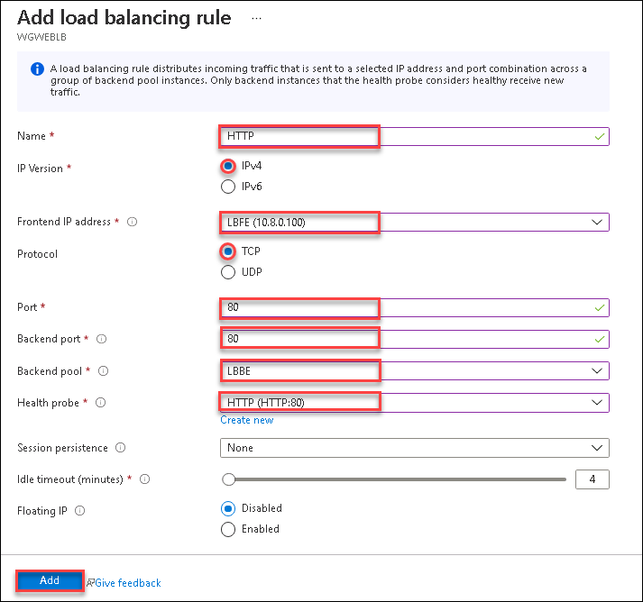

## Exercise 5: Configure n-tier application and validate functionality

Duration: 20 minutes

In this exercise, you will create and configure a load balancer to distribute load between the web servers. 

### Task 1: Create a load balancer to distribute load between the web servers

1.  In the Azure portal, select **Load balancers** on the left navigation then select **+ Create**.

2.  On the **Create load balancer** blade, on the **Basics** tab, enter the following values:

    -  Subscription: **Select your subscription**.

    -  Resource group: **WGVNetRG2**

    -  Name: **WGWEBLB**

    -  Region: **South Central US**

    -  Type: **Internal**

    -  SKU: **Standard**

    Ensure your **Create load balancer** dialog looks like the following, and select **Next: Frontend IP configuration** then select **Create**.

    

3. On the **Frontend IP configuration** tile, select **+ Add a frontend IP configuration and enter the following values:

    -  Name: **WGWEBLBIP**
  
    -  Virtual network: **WGVNet2**

    -  Subnet: **AppSubnet (10.8.0.0/25)**

    -  IP address assignment: Select **Static** and enter the IP address **10.8.0.100**.

    Ensure your **Create load balancer - Frontend IP configuration** dialog looks like the following, and select **Add**, **Review + create** then select **Create**.

    

    >**Note**: **Backend pools** can now be configured within the **Create Load balancer** wizard.  For this exercise, we will complete this in the next task.

### Task 2: Configure the load balancer

1.  Open the **WGWEBLB** load balancer in the Azure portal.

2.  Select **Backend pools**, and select **+Add** at the beginning.

    

3.  Enter **LBBE** for the pool name. Under **Associated to**, select **Virtual machine**.

    

4.  Under **Virtual machine**, choose the **WGWEB1** virtual machine and private IP address, then for the second virtual machine choose the **WGWEB2** virtual machine and private IP address.

5.  Select **Add** to add the backend pool.

6.  Wait to proceed until the Backend pool configuration is finished updating.

    

7.  Next, under **Settings** on the WGWEBLB Load Balancer blade select **Health Probes**. Select **+ Add**, and use the following information to create a health probe.

    

8. Enter the following values:

    -  Name: **HTTP**

    -  Protocol: **HTTP**
    
    

8.  Select **Add**.

9.  After the Health probe has updated. Select **Load balancing rules**. Select **+Add** and complete the configuration as shown below followed by selecting **Add**.

    - Name: **HTTP**
  
    - FrontEnd ip address: **WGWEBLBIP(10.8.0.100)**
   
    - Protocol: **TCP**

    - Port: **80**   

    - Backend port: **80**

    - Backend pool: **LBBE**

    - Health probe: **HTTP(HTTP:80)**

    

    **It will take 2-3 minutes for the changes to save.**

10. Connect to WGWEB1 via Bastion, use the given credentials for login to WGWEB1 i.e, Username: **demouser** Password: **demo@pass123**. Open your browser and navigate to <http://10.8.0.100>. Ensure that you successfully connect to either one of two Web servers.

    

    

11. Using the portal, disassociate the public IP from the NIC of **WGWEB1** **VM**. Do this by navigating to the VM and selecting **Networking** under **Settings** on the left. Select the **NIC Public IP** then choose **Dissociate**. Select **Yes** when prompted.

    

12. Next, return to the **WGWEB1 - Networking** blade and select the **Network Interface**

13. Select **IP configurations** under **Settings** on the left.

    

14. Next, select **ipconfig1** shown above.

15. Select and make sure that the **Public IP address settings** is shown as disabled, and select **Save** if necessary. This should remove the public IP address from the network interface of the VM.

    

