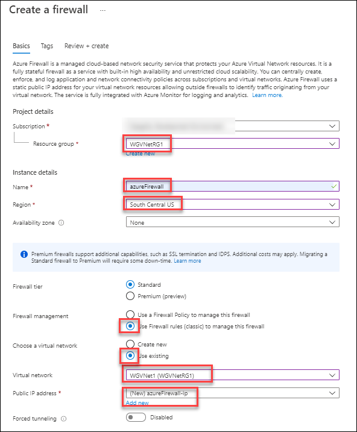

## Exercise 6: Provision and configure Azure firewall solution

Duration: 15 minutes

In this exercise, you will provision and configure an Azure firewall in your network. 

### Task 1: Provision the Azure firewall

1.  In the Azure portal, select **+ Create a resource**. In the **Search the Marketplace** text box, type **Firewall**, in the list of results, select **Firewall**, and on the **Firewall** blade, select **Create**.

2.  On the **Create a firewall** blade, on the **Basics** tab, enter the following information: 

    -  Subscription: select your subscription.

    -  Resource group: **WGVNetRG1**

    -  Name: **azureFirewall**

    -  Region: **(US) South Central US**

    -  Firewall management: **Use Firewall rules (classic) to manage this Firewall**

    -  Select a Virtual network: Select **Use existing** and then select **WGVNet1**.

    -  Public IP address: **Add new**

    -  Public IP address name: **azureFirewall-ip**

    -  Public IP address SKU: **Standard**

        

3.  Select **Review + create** and then select **Create** to provision the Azure Firewall. 

### Task 2: Create Firewall Rules

Within 1-2 minutes, the resource group **WGVNetRG1** will have the firewall created. Next, we will firewall rules to allow the inbound and outbound traffic.

1.  On the main Azure menu select **Resource groups**.

2.  Select the **WGVNetRG1** resource group. This resource group contains the azure firewall and its public IP address resources.

3.  Navigate to the **azureFirewall-ip** blade and note the value of its public IP address. You will need it later in this task.

4.  Navigate to the **azureFirewall** blade, and, on the **Overview** page, select **Rules** under **Settings** on the left.

    

5.  Select **+ Add NAT Rule collection** and enter the following information to create an inbound NAT Rule (collection is a list of rules that share the same priority and action):

    -  Name: **NATRuleCollection1**

    -  Priority: **250**

    -  Rules Name: **IncomingHTTP**

    -  Protocol: **TCP**

    -  Source: **\***

    -  Destination Address: Type the public IP address assigned to the firewall you identified earlier in this task.

    -  Destination ports: **80** (to allow HTTP traffic)

    -  Translated Address: **10.8.0.100** (Private IP of the Azure Load Balancer you deployed earlier in this lab.)
        
    -  Translated Port: **80**

6.  Create another rule for HTTPS, as illustrated on the following screenshot (alternatively you could create a single rule for both HTTP and HTTPS).

    - Rule Name: **IncomingHTTPS**
  
    - Protocol: **TCP**
  
    - Source: **\***
  
    - Destination Address: Type the public IP address assigned to the firewall you identified earlier in this task.
  
    - Destination ports: **443**
  
    - Translated Address: **10.8.0.100**
  
    - Translated Port: **443**

    

7.  Select **Add** and wait until the update completes.

8.  Back on the Azure Firewall **Rules** page, select **Network rule collection**. Then Select **+ Add Network Rule collection** and enter the following information to create a Network Rule for inbound traffic. This rule allows HTTP connectivity from any directly connected network targeting the frontend IP address of the load balancer.

    -  Name: **NetworkRuleCollectionAllow1**

    -  Priority: **100**

    -  Action: **Allow**

    -  Rule Name: **IncomingWeb**

    -  Protocol: **TCP**

    -  Source address: **\***

    -  Destination Address: **10.8.0.100**

    -  Destination ports: **80,443**

9.  Crate another rule for Remote Desktop sessions from the Management subnet on WGVNet1.

    -  Rule Name: **IncomingMgmtRDP**

    -  Protocol: **TCP**

    -  Source address: **10.7.2.0/25**

    -  Destination Address: **10.8.0.0/25**

    -  Destination ports: **3389**

    

10. Select **Add** and wait until the update completes.

### Task 3: Associate route tables to subnets

1.  In the Azure portal, navigate to the blade displaying properties of the **WGVNetRG2** resource group.

2.  Select **AppRT**, followed by **Subnets** and then select **+ Associate**.

    

3.  On the **Associate subnet** blade, select **WGVNet2** on the **Virtual network** drop down. Select **AppSubnet** on the **Subnet** dropdown. 

    

4.  Select **OK** at the bottom of the **Associate subnet** blade.

5.  Navigate to the blade displaying properties of the **WGVNetRG1** resource group, and select **MgmtRT**, then **Subnets**.

6.  Select the **+ Associate**.

7.  On the **Associate subnet** blade, select **WGVNet1** on the **Virtual network** drop down. Select **Management** on the **Subnet** dropdown. 

    

8.  Select **OK** at the bottom of the **Associate subnet** blade.

