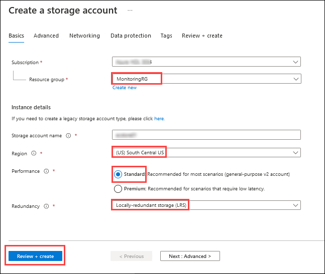

## Exercise 11: Using Network Watcher to Test and Validate Connectivity

Duration: 60 minutes

In this exercise, you will collect the flow log and perform connectivity from your simulated on-premises environment to Azure. This will be accomplished by using the Network Watcher Service in the Azure Platform.

### Task 1: Configuring the Storage Account for the NSG Flow Logs

1. On the Azure portal select **+ Create a resource**. From the Azure Marketplace menu select **storage** then select **Storage Account**

2. On the **Create Storage account** blade. Enter the following information, and select **Review + Create** then select the **Create** button:

    -  Subscription: **Your Subscription**

    -  Resource Group: **MonitoringRG** (Use the existing resource group created earlier.)

    -  Storage Account Name: **This must be Unique and alphanumeric, lowercase and no special characters.**

    -  Location: **South Central US**

    -  Performance: **Standard**

    -  Redundancy: **Locally-redundant storage (LRS)**

    

   >**Note:** Ensure the storage account is created before continuing.

3. Repeat steps 1 and 2, but select **East US** for the region and give it a different name.

4. On the Azure portal select **All services** at the left navigation. From the Categories menu select **Networking** then select **Network Watcher**.

5. From the **Network Watcher** blade under the **Logs** menu on the left, select **NSG flow logs**. Select **+ Create**. 

    

6. In the **Create a flow log** blade that appears, enter the following information then select **Next: Configuration**.

    - Subscription: **Select your subscription**

    - Network Security Group: **WGAppNSG1**

    - Storage Accounts: **The available storage account that you created earlier**.

    - Retention (days): **0**

    

7. On the **Configuration** tab of the **Create a flow log** blade, enter the following information then select **Review + create** then **Create**. 

    - Flow Logs Version: **Version 2**

    - Enable Traffic Analytics: **Checked**

    - Traffic Analytics processing interval: **Every 10 minutes**

    - Log Analytics Workspace: **The log analytics workspace you created earlier**

8.  Repeat Steps 5 - 7 to create a flow log for the **OnPremVM-nsg** Network Security Group as well. When completed your **NSG flow logs** blade on **Network Watcher** should look like what's depicted in the below image.

     

9.  Navigate back to the **OnPremVM**. Connect to it by downloading and opening the RDP file. Then open another RDP connection to the **WGWEB1** virtual machine within the connection to **OnPremVM**. In the RDP connection to **WGWEB1**, navigate to the load balancer's private ip address (**10.8.0.100**) and generate some traffic by refreshing the browser. Allow ten minutes to pass for traffic analytics to generate.  

     

### Task 2: Configuring Diagnostic Logs

1. On the Azure portal, select **All services** at the left navigation. From the Categories menu select **Networking**, then **Network Watcher**,

2. Select **Diagnostic Logs** from the **Logs Menu** within the blade.

     

3. Select **onpremvm*NNN*** then select **+Add diagnostic setting**.

4. Enter **OnPremDiag** as the name then select the checkbox for **Archive to a storage account**. On the **Storage accounts** drop down, select the available storage account you created earlier. 

     

5. Select the **Send to Log Analytics workspace** checkbox. Select the workspace created earlier in the dropdown. Select the **AllMetrics** checkbox and set the **Retention (days)** to **60**. Select the **Save** button to complete the settings.

     

6. Repeat Steps 2 - 5 for each network resource. Once completed your settings will look like the following screenshot.

     

### Task 3: Reviewing Network Traffic

1. On the Azure portal select **All services** at the left navigation. From the Categories menu select **Networking** then select **Network Watcher**.

2. Select **Traffic Analytics** from the **Logs** menu in the blade. At this time, the diagnostic logs from the network resources have been ingested. Select **View map**.

     

3. Select the **green check mark** which identifies your network. Within the pop-up menu select **More Details** to propagate detailed information of the flow to and from your network.

     

>**Note:** You can select the **See More** link to query the connections detail for more information.

### Task 4: Network Connection Troubleshooting

1. On the Azure portal select **All services** at the left navigation. From the Categories menu select **Networking** then select **Network Watcher**.

2. Select **Connection Troubleshoot** from the **Network Diagnostic tools** menu.

3. To troubleshoot a connection or to validate the route enter the following information and select **Check**:
   
    -  Subscription: **Your Subscription**

    -  Resource Group: **OnPremVMRG**

    -  Source Type: **Virtual Machine**

    -  Virtual Machine: **OnPremVM**

    -  Destination: **Select a virtual machine**
 
    -  Resource Group: **WGVNetRG2**
 
    -  Virtual Machine: **WGWEB1**

    -  Protocol: **TCP**
    
    -  Destination Port: **80**

     

4. Once the check is complete the connection troubleshoot feature will display a grid view on the name, IP Address Status and Next hop as seen in the following screenshot. 

     
